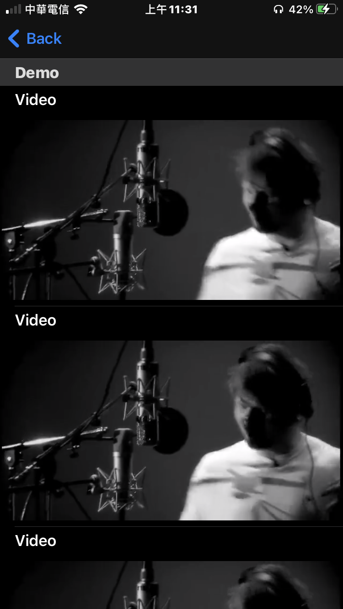

# IRMultiplePlayerLayout 

- IRMultiplePlayerLayout is a multiple video players  for iOS.

- Using the video player([IRPlayer](https://github.com/irons163/IRPlayer)).
- Using naitve TableView.
- Using Texture/AsyncDisplayKit ([Texture](https://github.com/TextureGroup/Texture)).
- Sibling repository: [IRMultiplePlayers](https://github.com/irons163/IRMultiplePlayers).

## Features
- Support naitve TableView.
- Support Texture framework.

## Install
### Git
- Git clone this project.

## Usage

### Basic
- Setup `ASTableNode`.
```obj-c
_tableNode = [[ASTableNode alloc] init];
_tableNode.delegate = self;
_tableNode.dataSource = self;
```

- Setup `VideoModel`.
```obj-c
NSString *videoUrlString = @"https://www.w3schools.com/html/mov_bbb.mp4";
  NSString *avatarUrlString = @"https://www.google.com.tw/images/branding/googlelogo/2x/googlelogo_color_160x56dp.png";

_title      = @"Demo title";
_url        = [NSURL URLWithString:videoUrlString];
_userName   = @"Random User";
_avatarUrl  = [NSURL URLWithString:avatarUrlString];
```

## Screenshots
| Demo1 | Demo2 |
|:---:|:---:|
|  |  |

